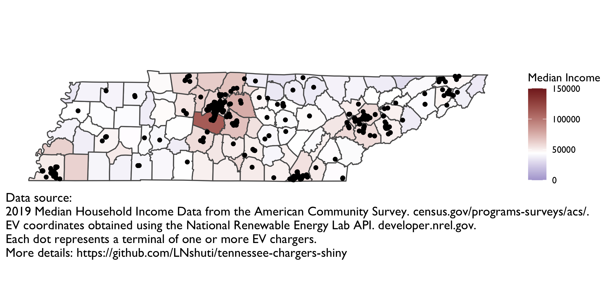

# Tennessee EV Charger Locator

App showing interactive map of EV charging infrastructure in Tennessee using Shiny and Leaflet in R. Using the median income by geography, we test the hypothesis:

*The location of chargers is correlated with income holding the population distribution constant.* 

